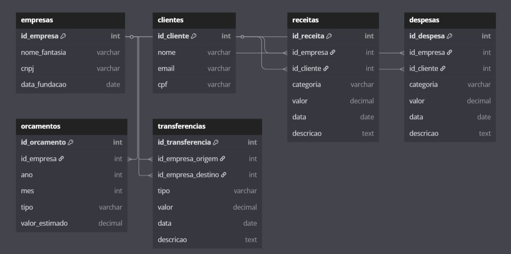

# projeto de engenharia de dados

Este repositório apresenta a solução desenvolvida para o desafio técnico de engenharia de dados, com foco em ingestão, modelagem e análise de dados financeiros de uma holding, que administra diversas companhias do grupo.

## Estrutura do Projeto

O projeto está organizado em três etapas principais:

1. **Ingestão e Transformação de Dados**  
   Os arquivos CSV fornecidos (empresas, clientes, receitas, despesas, orçamentos e transferências) foram carregados com padronização de colunas, conversão de tipos, tratamento de dados ausentes e normalização de categorias.

2. **Modelagem e Persistência**  
   Os dados foram estruturados em um banco de dados relacional SQLite. As tabelas foram definidas com chaves primárias e estrangeiras para estabelecer relacionamentos entre as entidades.

3. **Análise e Visualização**  
   A base consolidada foi conectada ao Power BI via Python, onde foram desenvolvidos dashboards com indicadores financeiros por empresa, cliente e categoria, incluindo receita, despesa, lucro e orçamento.

## Tecnologias Utilizadas

- Python 3.10
- Pandas
- SQLite3
- Power BI
- Git e GitHub (versionamento e repositório)

## Pipeline de ETL

O script `create_tables_and_etl.py` realiza o processo de extração, transformação e carregamento dos dados:

- Leitura e padronização dos arquivos CSV
- Conversão de tipos (datas, numéricos)
- Criação das tabelas com integridade relacional
- Inserção dos dados tratados no banco `dados.db`

## Modelagem de Dados

A modelagem foi orientada a entidades como empresas, clientes, receitas, despesas, orçamentos e transferências, com seus respectivos relacionamentos mapeados em um diagrama entidade-relacionamento (ER).

Mais detalhes estão disponíveis na pasta `documentacao_modelagem`.

## Análises e Visualizações

O Power BI foi utilizado para construir dashboards com foco em identificar as principais métricas de maximização e minimização, como os maiores e menores valores de receita, lucro, despesa e orçamento entre empresas e categorias.

## Documentação da Modelagem Relacional

A modelagem foi representada em um diagrama entidade-relacionamento (ER), ilustrando as tabelas principais e seus vínculos por chaves.

A descrição detalhada das entidades e relacionamentos pode ser consultada no arquivo `documentacao_modelagem/modelagem.md`.

## Considerações Finais

O projeto implementa um pipeline completo de engenharia de dados, partindo da ingestão de dados brutos até a geração de relatórios interativos em Power BI. A solução foi construída com foco na integridade dos dados e na preparação para análises empresariais.

